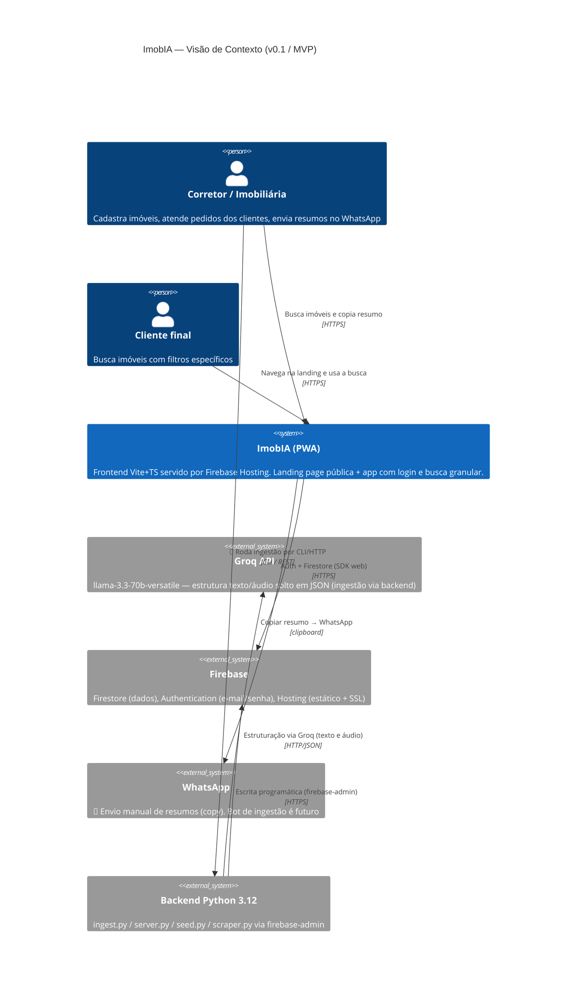

# Diagrama 0 — Arquitetura Macro (C4 Context)

> Fonte: `firebase.json`, `frontend/src/firebase.ts`, `backend/config.py`, `backend/firestore_repo.py`



## Limites de confiança

```mermaid
C4Boundary
  title Limites de confiança do ImobIA
  Boundary(frontend, "FRONTEND — público", "Firebase Hosting, PWA, SPA com roteamento hash (#/ e #/app)") {
    System(landing, "landing.ts", "Landing + formulário de leads (coleção leads) + Analytics")
    System(app, "ui.ts + main.ts", "Login/cadastro (e-mail/senha) e dashboard de busca")
    System(busca, "services/imoveis.ts", "Query Firestore + filtro/ordenação em memória + listarBairros")
  }

  Boundary(backend, "BACKEND — privado (CLI local + HTTP)", "Python 3.12, firebase-admin") {
    System(ingest, "ingest.py", "Recebe --entrada / --arquivo / --link / --audio")
    System(server, "server.py", "Flask: GET /health, POST /ingestir (texto/url/audio)")
    System(captura, "captura.py", "requests + BeautifulSoup → título/OG/descrição/parágrafos")
    System(estrutura, "estrutura.py", "Prompt Groq + whisper-large-v3 + normalização JSON")
    System(repo, "firestore_repo.py", "salvar_imovel / listar_imoveis")
    System(scraper, "scraper.py", "Adapters por site + detecção de duplicados (--dry-run)")
  }

  Boundary(firebase, "FIREBASE — nuvem", "Regras + índices em firestore.rules / firestore.indexes.json") {
    System(fstore, "Firestore", "coleções imoveis, usuarios e leads")
    System(fauth, "Authentication", "E-mail e senha")
    System(fanalytics, "Analytics", "Eventos busca, copiar_resumo, lead_enviado")
  }
```

## Notas

- A landing (`#/`) e o app (`#/app`) são o **mesmo bundle**; a rota é decidida por `window.location.hash` em `main.ts`.
- O backend hoje executa **localmente via CLI/HTTP** (`server.py`) — a integração WhatsApp via bot apontando para esse endpoint ainda é backlog.
- Regras de segurança: leitura de `imoveis`/`usuarios` autenticada; escrita apenas `admin`/`owner`; `leads` aceita `create` público validado por campos (`firestore.rules`).
- **CI/CD:** GitHub Actions roda pytest + build + deploy em `main`.
