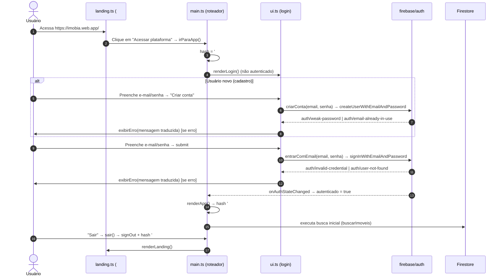
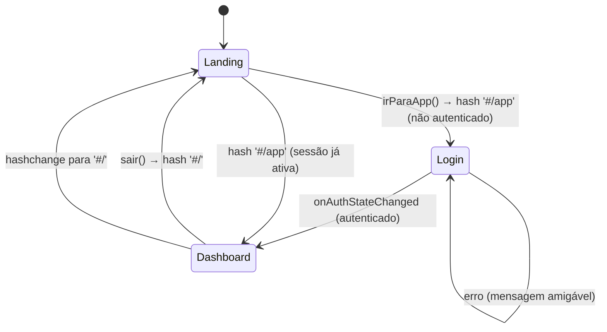
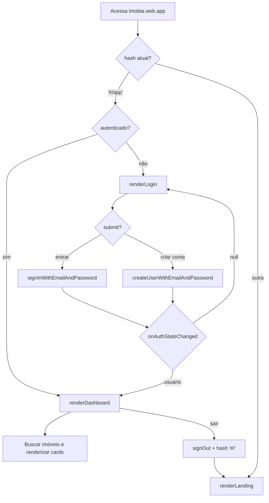

# Diagrama 1 — Workflow de Autenticação

> Fontes: `frontend/src/main.ts`, `frontend/src/ui.ts`, `frontend/src/landing.ts`
> Firebase: Authentication (e-mail/senha), Firestore (coleção `usuarios`)

## Sequência (primeiro acesso — usuário novo)

## Decisão de rota (state)

## Fluxo de decisão (flowchart)

## Mapa para testes

| # | Cenário | Resultado esperado |
|---|---------|--------------------|
| A1 | Login com e-mail/senha válidos | Dashboard renderizado |
| A2 | Login com senha errada | `E-mail ou senha incorretos.` no `#login-erro` |
| A3 | Cadastro com e-mail já usado | `Este e-mail já está cadastrado.` |
| A4 | Cadastro com senha < 6 | `A senha deve ter pelo menos 6 caracteres.` |
| A5 | Sessão ativa + abrir `#/app` direto | Dashboard (sem passar pelo login) |
| A6 | Sair | Volta para a landing (`#/`) |
