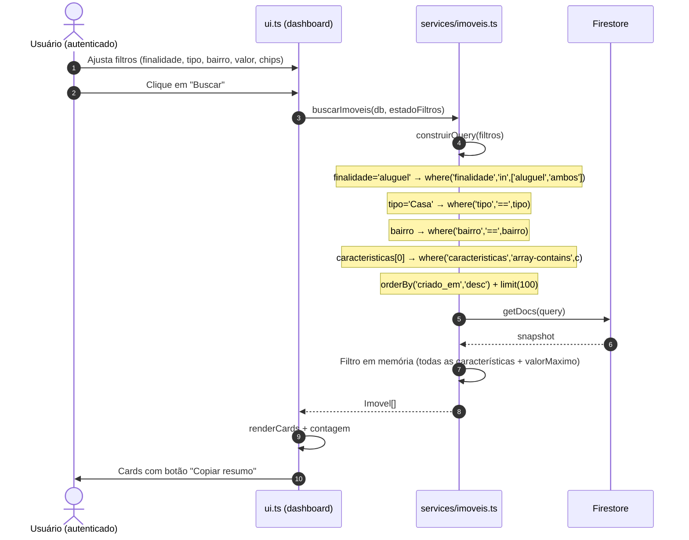

# Diagrama 2 — Workflow de Busca de Imóveis

> Fontes: `frontend/src/services/imoveis.ts`, `frontend/src/ui.ts`, `firestore.indexes.json`
> Firestore: coleção `imoveis` (query com `where`, `in`, `array-contains`, `orderBy`, `limit`)

## Sequência



## Fluxo de decisão

```mermaid
flowchart TD
  A[renderDashboard] --> B[Estado inicial: finalidade='ambos', caracteristicas=[]]
  B --> C[Clique em Buscar]
  C --> D{Ler inputs do DOM}
  D --> E[montar estadoFiltros]
  E --> F[buscarImoveis]
  F --> G[construirQuery: condicoes dinâmicas]
  G --> H[getDocs + orderBy criado_em desc + limit 100]
  H --> I[para cada doc]
  I --> J{todas características presentes?}
  J -->|não| K[descarta]
  J -->|sim| L{valorMaximo definido?}
  L -->|sim| M{valor do imóvel > valorMaximo?}
  M -->|sim| K
  M -->|não| N[adiciona ao resultado]
  L -->|não| N
  K --> I
  N --> I
  I --> O[renderCards]
  O --> P{Botão copiar resumo?}
  P -->|individual| Q[window.copiarUm(id) → clipboard]
  P -->|global| R[copiarResumo() → primeiro resultado → clipboard]
  Q --> S[toast: Resumo copiado]
  R --> S
```

## Mapa para testes

| # | Cenário | Resultado esperado |
|---|---------|--------------------|
| B1 | Buscar sem filtros | Até 100 imóveis mais recentes |
| B2 | Finalidade aluguel | Só `finalidade in [aluguel, ambos]` |
| B3 | Tipo = Casa | Só documentos com `tipo == 'Casa'` |
| B4 | Característica única (energia solar) | Query usa `array-contains` no Firestore |
| B5 | Duas+ características | Query usa só a 1ª; as demais filtradas em memória |
| B6 | valorMaximo = 3000 (aluguel) | Imóveis com `valor_aluguel > 3000` descartados |
| B7 | Copiar resumo (individual) | Texto formatado no clipboard + toast |
| B8 | Copiar resumo (global) | Resumo do primeiro resultado |
| B9 | Nenhum resultado | Mensagem "Nenhum imóvel encontrado com esses filtros." |
| B10 | Erro de query/índice | Mensagem de erro no `#cards` (não quebra a página) |

## Observações de arquitetura

- **Índices compostos** (`firestore.indexes.json`): `tipo+criado_em`, `bairro+criado_em`,
  `finalidade+criado_em`, `finalidade+tipo+criado_em`, `bairro+tipo+criado_em`, `caracteristicas+criado_em`.
- **Limitação conhecida:** múltiplos `array-contains` exigiriam índice composto por combinação;
  o MVP resolve a 1ª característica na query e o restante em memória (`imoveis.ts:buscarImoveis`).
