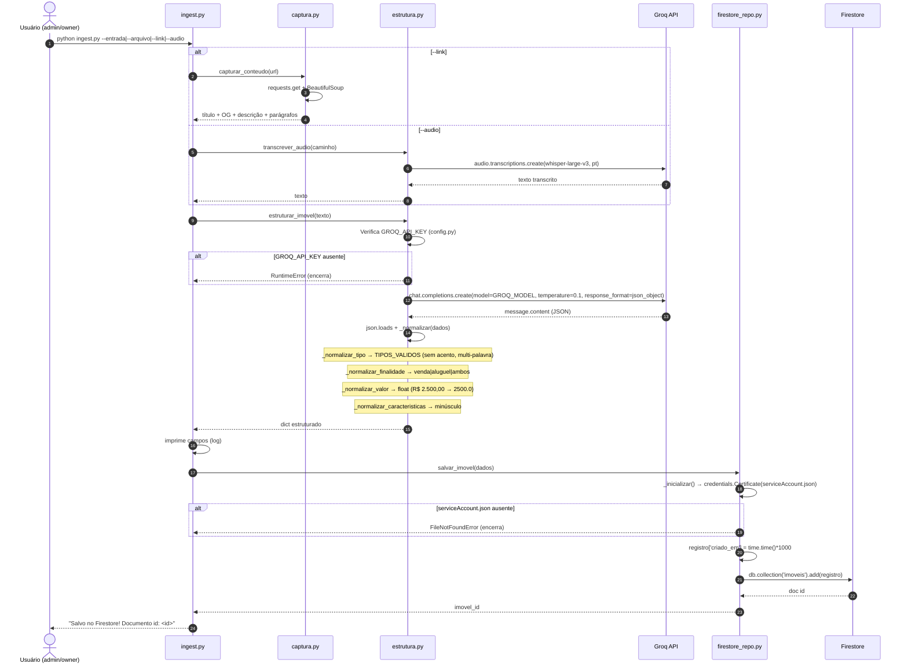
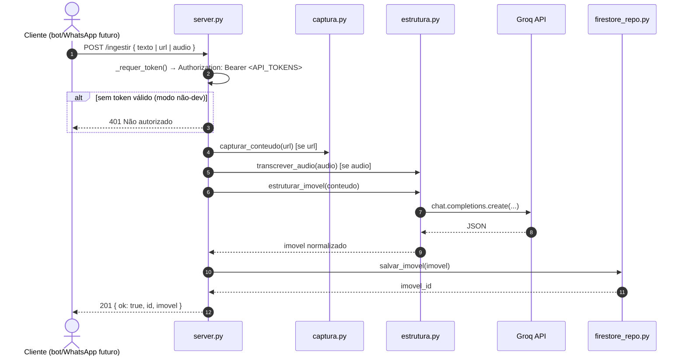

# Diagrama 3 — Workflow de Ingestão por IA (Groq)

> Fontes: `backend/ingest.py`, `backend/captura.py`, `backend/server.py`, `backend/estrutura.py`,
> `backend/firestore_repo.py`, `backend/config.py`
> Serviços: Groq API (`llama-3.3-70b-versatile`, `whisper-large-v3`), Firestore (coleção `imoveis`)

## Sequência (CLI)



## Endpoint HTTP (server.py — Flask)



## Fluxo de decisão (ingestão)

```mermaid
flowchart TD
  A[ingest.py | server.py] --> B{Tipo de entrada?}
  B -->|--entrada / texto| C[texto = entrada]
  B -->|--arquivo| D[ler arquivo .txt utf-8]
  B -->|--link / url| C2[capturar_conteudo url]
  B -->|--audio / audio| C3[transcrever_audio]
  C --> F{texto vazio?}
  D --> F
  C2 --> F
  C3 --> F
  F -->|sim| Z[exit 1 com erro]
  F -->|não| G[estruturar_imovel]
  G --> H{GROQ_API_KEY set?}
  H -->|não| Z
  H -->|sim| I[Groq chat.completions]
  I --> J[conteudo = message.content]
  J --> K[json.loads]
  K --> L[_normalizar]
  L --> M[salvar_imovel]
  M --> N{serviceAccount.json existe?}
  N -->|não| Z
  N -->|sim| O[firestore .add]
  O --> P[retorna doc id]
```

## Mapa para testes

| # | Cenário | Resultado esperado |
|---|---------|--------------------|
| C1 | `--entrada` com texto rico | JSON estruturado com todos os campos preenchidos |
| C2 | `--entrada` "Casa com energia solar e quintal no centro para alugar por 2500" | `tipo=Casa`, `finalidade=aluguel`, `valor_aluguel=2500.0`, características `[energia solar, quintal]` |
| C3 | Valor "R$ 2.500,00" | `_normalizar_valor` → `2500.0` |
| C4 | Sem `GROQ_API_KEY` | `RuntimeError` e encerramento |
| C5 | Sem `serviceAccount.json` | `FileNotFoundError` e encerramento |
| C6 | `--link` | `captura.py` baixa a URL e extrai título/OG/parágrafos |
| C6b | URL inválida ou sem conteúdo | `ValueError` com mensagem clara |
| C7 | Bairro ausente no texto | Default `"Outros"` |
| C8 | `--arquivo` inexistente | Falha de abertura de arquivo |
| C9 | `--audio` | `transcrever_audio` retorna texto (requer GROQ_API_KEY) |
| C10 | `POST /ingestir` com token inválido | 401 |
| C11 | `POST /ingestir` sem payload reconhecido | 400 |
| C12 | `GET /health` | `{ status: "ok" }` |

## Dependências externas (validadas por `pip install -r requirements.txt`)

- `groq==0.10.0`, `firebase-admin==6.5.0`, `python-dotenv==1.0.1`, `requests==2.32.3`,
  `flask==3.0.3`, `beautifulsoup4==4.12.3`, `pytest==8.2.2`, `pytest-mock==3.14.0`

## Notas

- A ingestão via **WhatsApp** (bot disparando o endpoint HTTP) ainda é backlog.
- O fluxo usa `response_format=json_object` para forçar saída estruturada do Groq.
- `_normalizar` garante campos obrigatórios e tipos corretos antes de persistir.
- `server.py` aceita `API_TOKENS` (CSV) via env; por padrão roda em modo dev sem exigir token.
