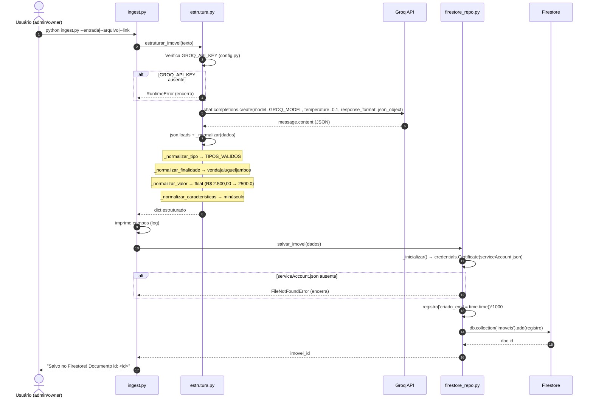
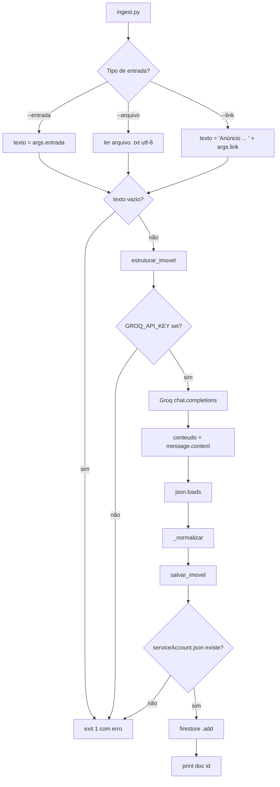

# Diagrama 3 — Workflow de Ingestão por IA (Groq)

> Fontes: `backend/ingest.py`, `backend/estrutura.py`, `backend/firestore_repo.py`, `backend/config.py`
> Serviços: Groq API (`llama-3.3-70b-versatile`), Firestore (coleção `imoveis`)

## Sequência (CLI)

## Fluxo de decisão (ingestão)

## Mapa para testes

| # | Cenário | Resultado esperado |
|---|---------|--------------------|
| C1 | `--entrada` com texto rico | JSON estruturado com todos os campos preenchidos |
| C2 | `--entrada` "Casa com energia solar e quintal no centro para alugar por 2500" | `tipo=Casa`, `finalidade=aluguel`, `valor_aluguel=2500.0`, características `[energia solar, quintal]` |
| C3 | Valor "R$ 2.500,00" | `_normalizar_valor` → `2500.0` |
| C4 | Sem `GROQ_API_KEY` | `RuntimeError` e encerramento |
| C5 | Sem `serviceAccount.json` | `FileNotFoundError` e encerramento |
| C6 | `--link` | Texto com a URL (conteúdo da página ainda não é baixado 🚧) |
| C7 | Bairro ausente no texto | Default `"Outros"` |
| C8 | `--arquivo` inexistente | Falha de abertura de arquivo |

## Dependências externas (validadas por `pip install -r requirements.txt`)

- `groq==0.10.0`, `firebase-admin==6.5.0`, `python-dotenv==1.0.1`, `requests==2.32.3`

## Notas

- A ingestão via **link real** (baixar conteúdo da página) e via **WhatsApp** são backlog (Fase 2).
- O fluxo usa `response_format=json_object` para forçar saída estruturada do Groq.
- `_normalizar` garante campos obrigatórios e tipos corretos antes de persistir.
