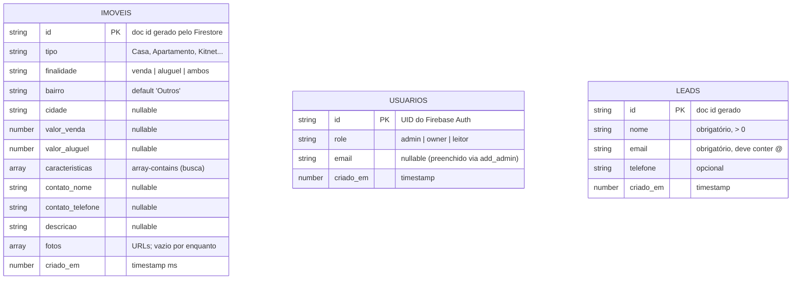
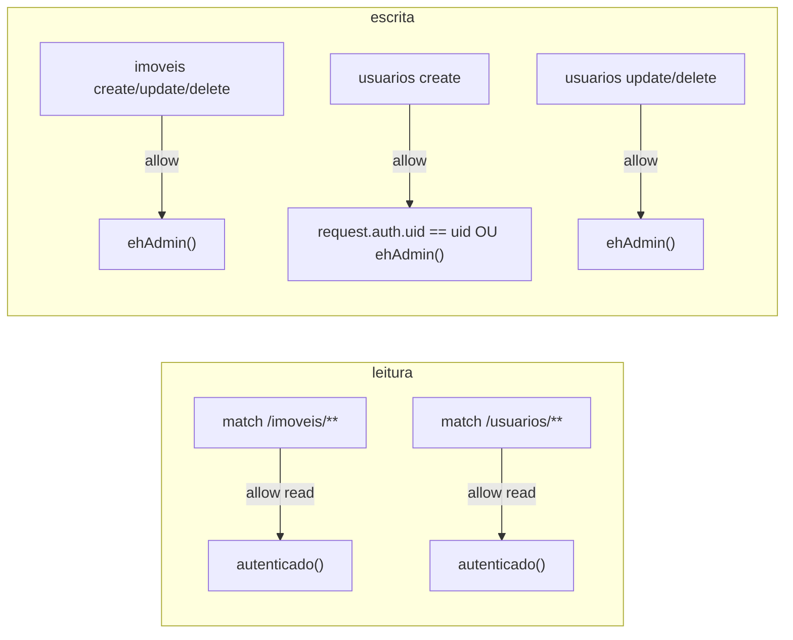
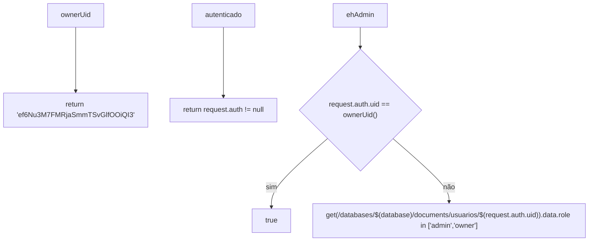
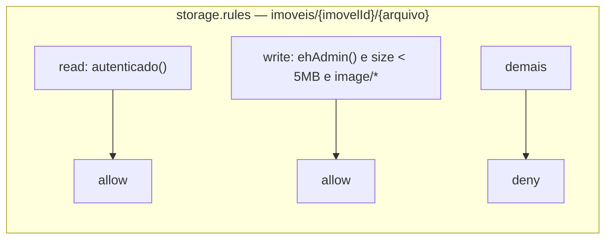

# Diagrama 4 — Modelo de Dados (Firestore)

> Fontes: `frontend/src/types.ts`, `backend/estrutura.py` (SCHEMA), `firestore.rules`,
> `backend/add_admin.py` (coleção `usuarios`), `backend/seed.py`

## Regras de segurança (resumo — `firestore.rules`)

## Funções auxiliares (Firestore rules)

## Mapa para testes

| # | Cenário | Resultado esperado |
|---|---------|--------------------|
| D1 | Usuário não autenticado lê `imoveis` | Negado |
| D2 | Usuário autenticado (`leitor`) lê `imoveis` | Permitido |
| D3 | `leitor` tenta criar/editar imóvel | Negado |
| D4 | `owner`/`admin` cria imóvel | Permitido |
| D5 | Usuário cria doc em `usuarios/{seuUID}` | Permitido |
| D6 | Usuário cria doc em `usuarios/{UID de outro}` | Negado |
| D7 | Owner raiz (`ef6Nu3M7...`) tem acesso admin | Permitido mesmo sem doc em `usuarios` |
| D8 | Editar doc de outro usuário | Negado (só `ehAdmin()`) |
| L1 | Anônimo cria lead válido (nome+email) | Permitido |
| L2 | Lead com email inválido (sem `@`) | Negado |
| L3 | Anônimo lê coleção `leads` | Negado |
| L4 | Admin lê `leads` | Permitido |

## Notas de modelagem

- `caracteristicas` é um **array** → permite `array-contains` na query de busca.
- `finalidade` é **string** → busca por `in` (`['venda','ambos']` ou `['aluguel','ambos']`).
- O ID de `usuarios` é o **UID** do Firebase Auth (add_admin usa `document(uid).set(merge=True)`).
- `criado_em` em milissegundos para casar frontend (`types.ts`) e backend (`firestore_repo.py`).
- `fotos` é um **array de URLs** (Storage). As regras de `storage.rules` espelham os papéis:
  leitura autenticada; escrita admin/owner; tamanho máx 5 MB; `image/*`.

## Cloud Storage (fotos)

