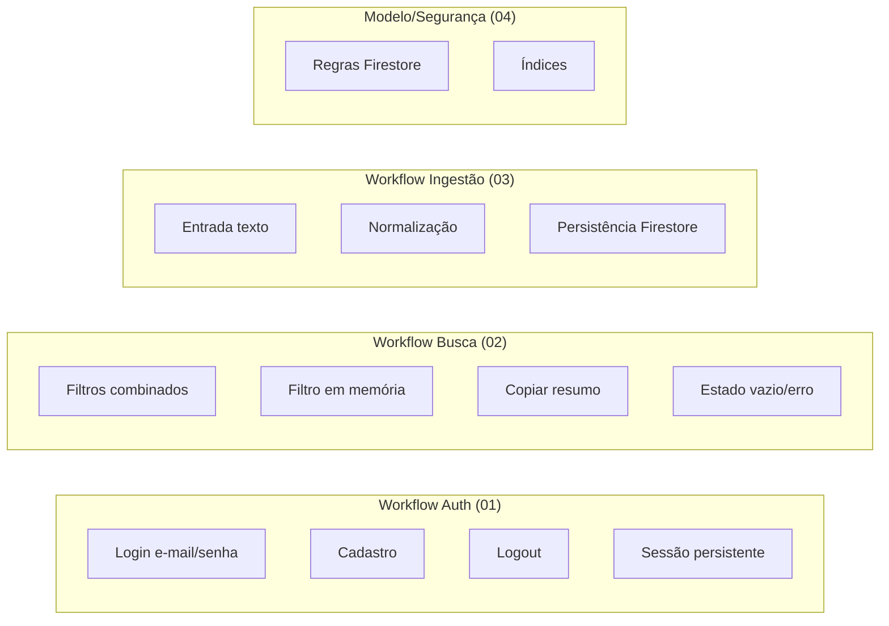
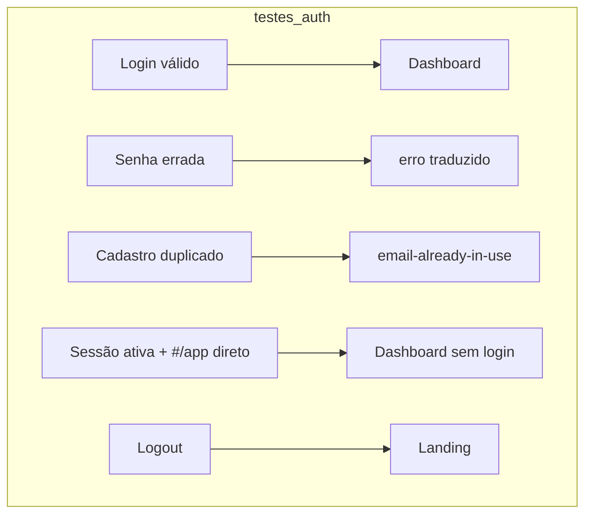
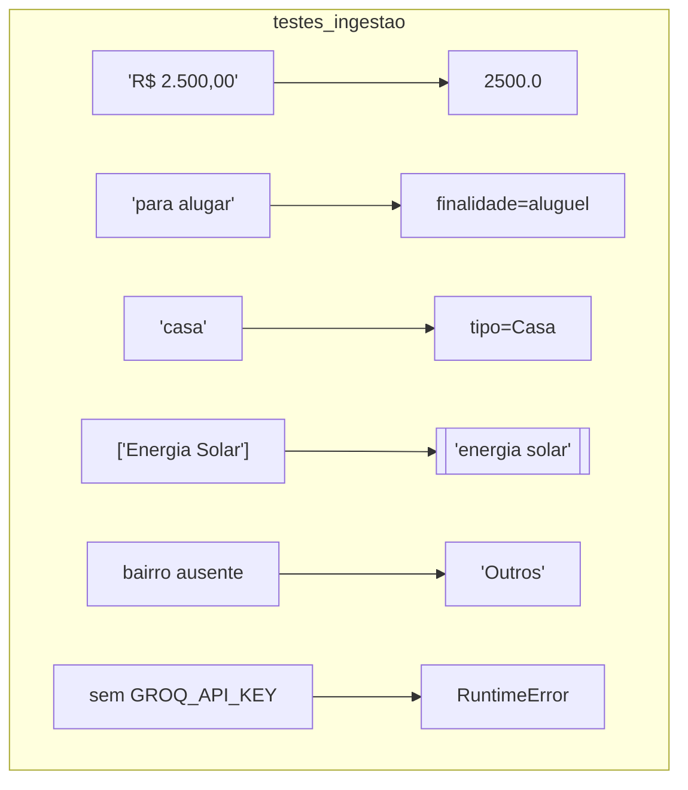

# Diagrama 5 — Matriz de Testes por Workflow (Recorrente)

> **Objetivo:** converter cada workflow mapeado em cenários de teste concretos.
> Este documento é **vivo** — atualizado a cada sprint/feature nova.
>
> Legenda: ✅ automável · 🧪 manual · 🚧 depende de recurso não implementado

## Visão geral



## Autenticação — detalhe



## Busca — detalhe (foco em filtros em memória)

```mermaid
flowchart TD
  subgraph testes_busca
    Q1[1 característica] -->|query array-contains| R1[ok]
    Q2[2+ características] -->|1ª na query, resto em memória| R2[ok]
    Q3[valorMaximo aluguel] -->|descarta valor_aluguel > limite| R3[ok]
    Q4[finalidade venda] -->|in ['venda','ambos']| R4[ok]
    Q5[sem resultados] --> R5[mensagem vazio]
  end
```

## Ingestão — detalhe (normalização)



## Cadastro de executáveis

### Unitários (pytest, backend)

- [ ] `test_estrutura.py` — `_normalizar_valor`, `_normalizar_finalidade`, `_normalizar_tipo`,
      `_normalizar_caracteristicas`, bairro default, campos ausentes.
- [ ] `test_firestore_repo.py` — (mock) `salvar_imovel` seta `criado_em`; erro sem serviceAccount.

### E2E / Integração (Playwright + emulador Firestore)

- [ ] Fluxo completo: landing → criar conta → login → buscar → copiar resumo → logout.
- [ ] Filtro combinado: `Aluguel + Casa + valor 3000 + energia solar`.
- [ ] Regras: testar negativa de escrita por `leitor` (via emulador).

### Manuais (🧪)

- [ ] Deploy em produção: login/cadastro no https://imobia.web.app.
- [ ] PWA: instalar, recarregar offline, verificar service worker.
- [ ] Ingestão CLI com `serviceAccount.json` real + `GROQ_API_KEY` real.

## Status do estudo

| Workflow | Diagrama | Cenários | Automação | Status |
|----------|----------|----------|-----------|--------|
| Arquitetura | `00-arquitetura.md` | — | — | ✅ Documentado |
| Autenticação | `01-auth-workflow.md` | A1–A6 | ✅ Playwright (7 E2E) | ✅ Documentado e testado |
| Busca | `02-busca-workflow.md` | B1–B11 | ✅ Playwright (filtros) | ✅ Documentado e testado |
| Ingestão | `03-ingestao-workflow.md` | C1–C12 | ✅ pytest (71) | ✅ Documentado e testado |
| API/Validação | `03-ingestao-workflow.md` | P1–P8, S1–S5 | ✅ pytest (test_validacao/test_server) | ✅ Documentado e testado |
| WhatsApp | `03-ingestao-workflow.md` | W1–W3 | ✅ pytest (webhook) | ✅ Documentado e testado |
| Fotos | `04-dados-er.md` | F1–F3 | 🚧 manual/emulador storage | ✅ Implementado |
| Dados/Segurança | `04-dados-er.md` | D1–D8 + L1–L4 | ✅ emulador (11) | ✅ Documentado e testado |

> **Recorrência:** ao final de cada sprint, rodar a matriz; a cada feature nova, adicionar diagrama e cenários.

## Execuções registradas (Sprints 10–12)

| Data | Suite | Resultado |
|------|-------|-----------|
| Ago/2026 | `pytest backend/tests/` (estrutura + firestore_repo + captura + validacao + server) | 71 passando |
| Ago/2026 | `tests/rules/test-rules.mjs` (emulador) | 11 passando |
| Ago/2026 | `playwright test` (E2E contra produção) | 7 passando |

## Novos cenários (Sprint 12)

| # | Workflow | Cenário |
|---|----------|---------|
| P1 | API | Payload vazio → 400 com mensagem |
| P2 | API | texto + url juntos → 400 ("apenas um") |
| P3 | API | texto muito longo → 400 |
| P4 | API | url inválida → 400 |
| P5 | API | texto válido → 201 com id |
| P6 | API | audio inexistente → 400 |
| S1 | Rate limit | Health exempto de rate limit |
| W1 | WhatsApp | Webhook sem Body → TwiML de orientação |
| W2 | WhatsApp | Mídia não-áudio → "Envie um texto ou áudio" |
| W3 | WhatsApp | Body válido → resposta TwiML em XML |
